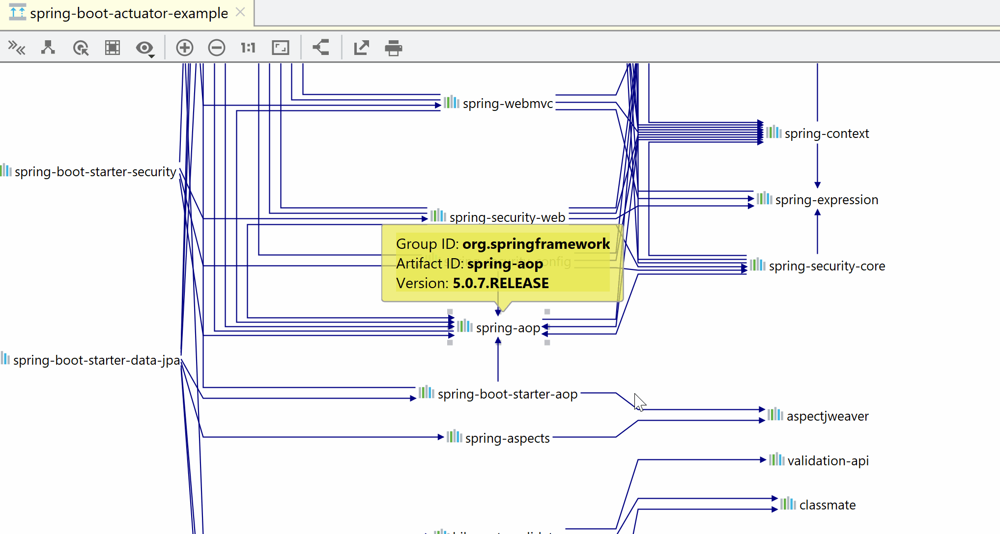
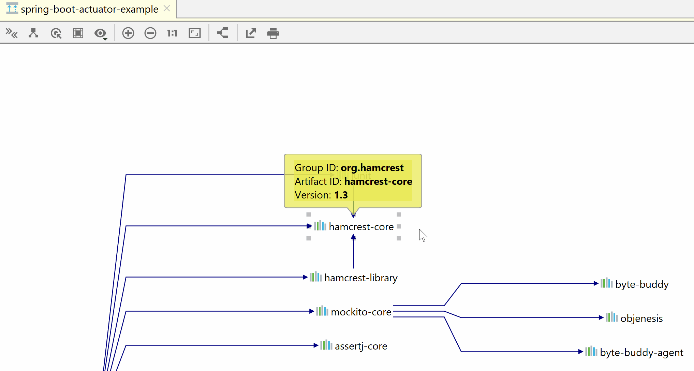

## Analyzing Maven dependencies
In Maven project, you can get into all sorts of trouble with your dependencies, such as dependency conflicts or cyclic dependencies. Maven offers you to generate dependency tree representation by calling:

```
mvn dependency:tree -Dverbose -DoutputFile=dependencies.txt
```

Plain text format can look something like this ([here is the full example](https://gist.github.com/vojtechruz/0f8394f71bb9c4ae324a8dc4518c5761#file-plain-text)):

```
--- maven-dependency-plugin:3.0.2:tree (default-cli) @ spring-boot-actuator-example ---
com.vojtechruzicka:spring-boot-actuator-example:jar:1.0.0-SNAPSHOT
+- org.springframework.boot:spring-boot-starter-actuator:jar:2.0.3.RELEASE:compile
|  +- org.springframework.boot:spring-boot-starter:jar:2.0.3.RELEASE:compile
|  |  +- org.springframework.boot:spring-boot:jar:2.0.3.RELEASE:compile
|  |  +- org.springframework.boot:spring-boot-autoconfigure:jar:2.0.3.RELEASE:compile
|  |  +- org.springframework.boot:spring-boot-starter-logging:jar:2.0.3.RELEASE:compile
|  |  |  +- ch.qos.logback:logback-classic:jar:1.2.3:compile
|  |  |  |  \- ch.qos.logback:logback-core:jar:1.2.3:compile
|  |  |  +- org.apache.logging.log4j:log4j-to-slf4j:jar:2.10.0:compile
|  |  |  |  \- org.apache.logging.log4j:log4j-api:jar:2.10.0:compile
|  |  |  \- org.slf4j:jul-to-slf4j:jar:1.7.25:compile
|  |  +- javax.annotation:javax.annotation-api:jar:1.3.2:compile
|  |  \- org.yaml:snakeyaml:jar:1.19:runtime
```

But it offers various other formats as output, which are better suited for representing dependency graph such as [graphml](https://gist.github.com/vojtechruz/0f8394f71bb9c4ae324a8dc4518c5761#file-graphml) or [tgf](https://gist.github.com/vojtechruz/0f8394f71bb9c4ae324a8dc4518c5761#file-tgf).

You can specify some other parameters to help you with investigation, but for larger projects, it can be cumbersome to work with dependency tree output directly. Fortunately, IDEA offers a nice GUI tool to work with Maven dependency graphs.

This tool is in IntelliJ for quite some time, but as of version 2019.1, it received some needed enhancements, which make it much more useful in projects with large dependency graphs.

To show the graph, go inside a `pom.xml` file and press <kbd>Shift</kbd> + <kbd>Ctrl</kbd> + <kbd>Alt</kbd> + <kbd>U</kbd> (or <kbd>⌥</kbd> + <kbd>⇧</kbd> + <kbd>⌘</kbd> + <kbd>U</kbd> on Mac). Alternatively `Right click → Diagrams → Show Dependencies`.

You'll see zoomed out dependency graph, where it is not possible to see individual item names unless you zoom in. Looking for individual items manually can be a lot of pain. Fortunately, you can use `Find` as usual using <kbd>Ctrl</kbd> + <kbd>F</kbd>.


We are able to locate a specific dependency easily now, but still a lot of unrelated dependencies making the graph hard to read. Let's look into how to filter the dependencies to get rid of unwanted noise.

First option is to show only direct neighbors. That is, only direct dependencies of the current item and only items that directly depend on the selected item.



Note that this works not only for single items, but you can select multiple items while holding <kbd>Shift</kbd>. 

Another way to filter is no display the dependency chain leading from the root to the selected item(s).



IDEA does highlight conflicts for you in red. Still, it may be difficult to find if there is something wrong in a huge dependency tree. Fortunately, you can filter problematic parts only:


In the example above, you can see there is a conflict between junit versions. There is an explicit dependency to junit 3.8.1 and a different version transitively taken through `spring-boot-starter-test`.