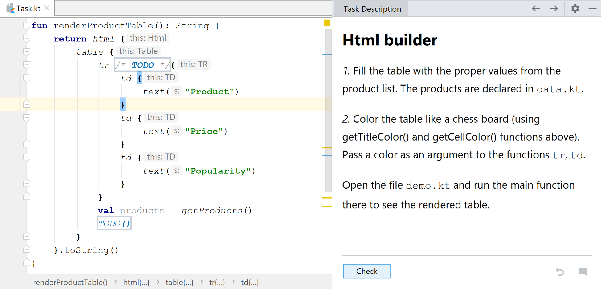

With IntelliJ IDEA Edu Tools plugin you can study various programming courses directly in your IDE and work on all the assignments. Alternatively, you can create courses yourself to share with others.

## Getting started
### Installation
If you already have IntelliJ IDEA installed, all you need to do is to install [EduTools plugin](https://plugins.jetbrains.com/plugin/10081-edutools). All you need to do is to go to `File → Settings → Plugins → Marketplace` and search for EduTools. Then just click `Install` and restart your IDE when finished. The plugin is available both for Ultimate and Community edition.

Alternatively, you can download [IntelliJ IDEA EDU](https://www.jetbrains.com/education/download/#section=idea), which is basically the Community Edition bundled with the EduTools plugin. If you are using Python, Jetbrains offer also [Pycharm EDU](https://www.jetbrains.com/pycharm-edu/).

### Starting a course
Now, after the plugin is installed, it is time to start using it. All the interactions with the plugin is handled through

```
File → Learn and Teach
```

There are several options there, including integration with third-party educational services, such as Coursera, Stepik or Hyperskill. We'll cover these later, let's start simple by browsing available courses in the course repository:

```
File → Learn and Teach → Browse Courses
```


Some courses are gray, which means they are not approved by JetBrains. To start a course, simply select it and click `Join`. The join button offer an alternative action to view the course as an Educator. This allows you to view also solutions and tests, which verify whether each taks is successfully completed.

Let's open a course in a normal way, as a student for now.

Instead of files contained in your project, you see all the chapters and the individual tasks contained in them.


You can see, that IDEA tracks you progress and you can see what is already finished (green), what is failed (red) and what is yet to be completed (empty checkboxes).

You can select and solve individual tasks in any order. After selecting a task, yo will see the task code in your editor and the description what should you change to complete the task.



Once you are finished with your task, you can verify your solution whether it is correct by clicking `Check` button.

It runs predefined unit tests under the hood  and based on the result it lets you know whether you passed or not.


You can either view the solution or just compare the expected output with what you have. Both these features show you a nice version control system-like diff so you can easily identify the differences.

## Integrations
The amount of courses available in the repository is still somewhat limited, so it is great that EduTools offers integration with several third party services, which offer their own courses.

### Stepik
[Stepik](https://stepik.org/catalog?language=en) is an online educational platform, where you can either study or publish your own courses.

You can log in in IDEA to your Stepik account. This has several advantages. You'll get access to a broader range of courses and now your progress is automatically synchronized with your Stepik account.

That means that you can study either in IDEA or Stepik web editor and your progress is tracked either way. It also acts as a online backup of your progress, because normally IDEA stores your progress just in a local folder.

You can access Stepik courses in IDEA by:

```
File → Learn and Teach → Start Stepik Course
```

### Hyperskill
[Hyperskill](https://hyperskill.org) is another service integrated by EduTools. It is actually developed by Stepik. It is a very interesting tool with a slightly different focus. Instead of various independent courses, you build number of projects. There is a big Knowledge map of varios linked topics for each domain, where you can track your progress.


To open a Hyperskill project, go to:

 ```
 File → Learn and Teach → Start Hyperskill Project
 ```
 


### Coursera
[Coursera](https://www.coursera.org/) integration is a bit sporadic right now. There's just "Kotlin for Java Developers" by JetBrains, where you can solve your weekly assignments in IDEA. You can access coursera assignments in: `File → Learn and Teach → Start Coursera Assignment`.

### Checkio

