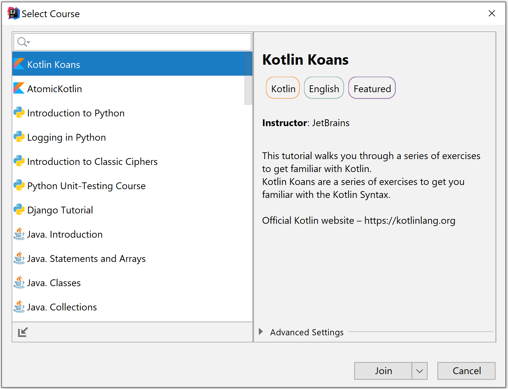
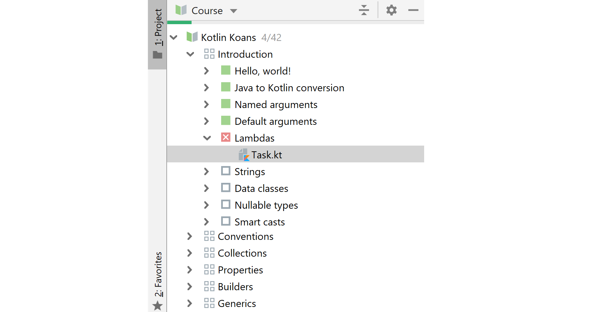

With IntelliJ IDEA Edu Tools plugin you can study various programming courses directly in your IDE and work on all the assignments. Alternatively, you can create courses yourself to share with others.

## Getting started
### Installation
If you already have IntelliJ IDEA installed, all you need to do is to install [EduTools plugin](https://plugins.jetbrains.com/plugin/10081-edutools). All you need to do is to go to `File -> Settings -> Plugins -> Marketplace` and search for EduTools. Then just click `Install` and restart your IDE when finished. The plugin is available both for Ultimate and Community edition.

Alternatively, you can download [IntelliJ IDEA EDU](https://www.jetbrains.com/education/download/#section=idea), which is basically the Community Edition bundled with the EduTools plugin. If you are using Python, Jetbrains offer also [Pycharm EDU](https://www.jetbrains.com/pycharm-edu/).

### Starting a course
Now, after the plugin is installed, it is time to start using it. All the interactions with the plugin is handled through

```
File -> Learn and Teach
```

There are several options there, including integration with third-party educational services, such as Coursera, Stepik or Hyperskill. We'll cover these later, let's start simple by browsing available courses in the course repository:

```
File -> Learn and Teach -> Browse Courses
```



Some courses are gray, which means they are not approved by JetBrains. To start a course, simply select it and click `Join`. The join button offer an alternative action to view the course as an Educator. This allows you to view also solutions and tests, which verify whether each taks is successfully completed.

Let's open a course in a normal way, as a student for now.

Instead of files contained in your project, you see all the chapters and the individual tasks contained in them.



You can see, that IDEA tracks you progress and you can see what is already finished (green), what is failed (red) and what is yet to be completed (empty checkboxes).

You can select and solve individual tasks in any order. After selecting a task, yo will see the task code in your editor and the description what should you change to complete the task.

## Integrations
### Stepik
### Hyperskill
### Coursera


TODO peek solution