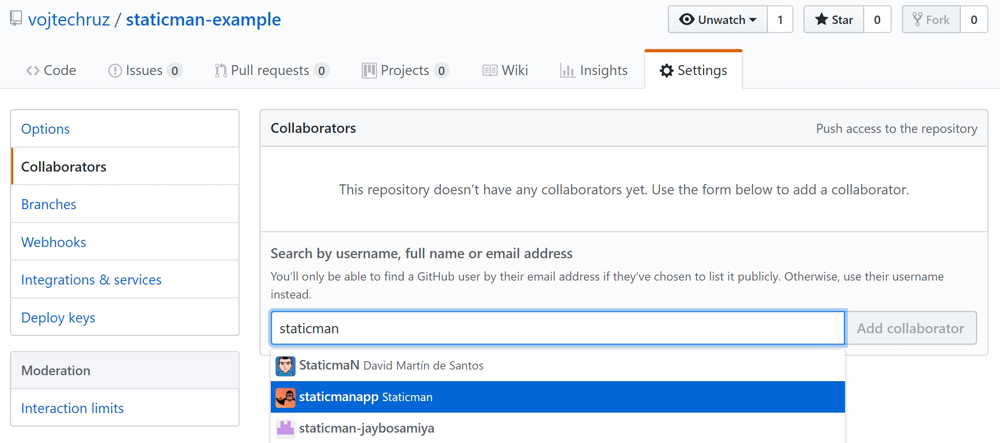

# Setup

## Granting Github access



After adding Staticman as a collaborator, you should see pending invite:


Now you need to open the following URL in your browser to make Staticman accept your invite:

```
https://api.staticman.net/v2/connect/{your GitHub username}/{your repository name}
```

With a real data it will look something like this:

```
https://api.staticman.net/v2/connect/vojtechruz/staticman-example
```

If all goes well, you should receive response `OK!`. And in the collaborators section you should no longer see pending invite.


## Adding a configuration file
Staticman loads its configuration from a yaml fille called `staticman.yml`. A sample file can be found [here](https://github.com/eduardoboucas/staticman/blob/master/staticman.sample.yml). Detailed explanation of all the available configuration options can be found in the [official documentation](https://staticman.net/docs/configuration).