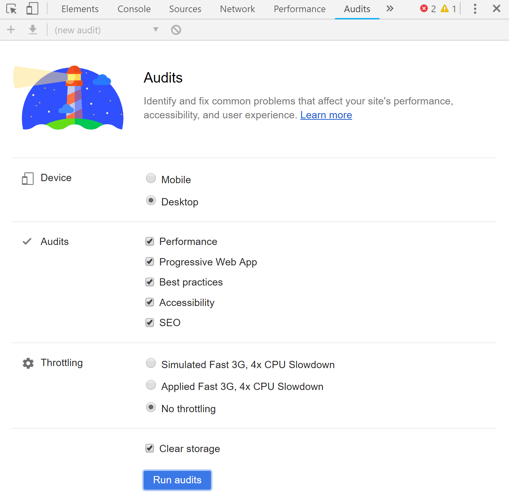
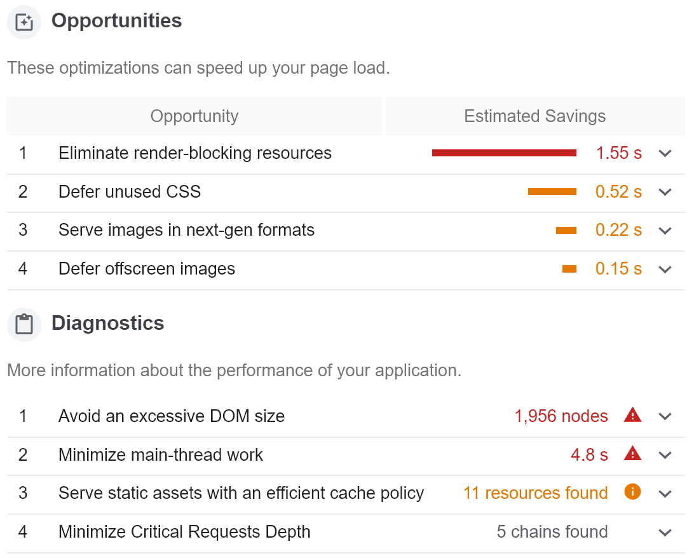

Did you know Chrome can perform a comprehensive audit of a web page and analyze many different categories such as Performance, SEO, Best Practices, Accessibility, Progressive Web Application compliance and more?

## Running an Audit

In version 60, Chrome introduced a great new addition to its Developer Tools. It is a comprehensive Audit feature for web pages powered by a tool called Lighthouse. It is an open source tool available on [GitHub](https://github.com/GoogleChrome/lighthouse). To run an audit, you need to open Chrome Dev Tools (<kbd>F12</kbd>) and select `Audits` tab:

Before running an audit, you can select various configuration options. First of all, you can select categories in which you want the target site to be audited. Disabling a category makes the analysis faster, but let's keep all the categories for now. Additionally, you can select whether Lighthouse should test your site as a mobile or desktop agent. Lastly, you can tell Chrome to emulate a device with slower CPU and slower network connection so you can check how your site performs on lower tier mobile devices with worse connectivity. It is worth checking as the results can be dramatically different from what you experience on your cutting-edge PC with a super-fast connection.

Now let's click the `Run audits`. Chrome analyzes your page for various potential problems in the selected categories. After the audit is done, you receive a score in each of the categories up to 100 points:

Note that installed Chrome extensions can have a negative impact on the results, so it may be better to run the audit in the incognito mode, where these extensions are disabled.

## Categories

In each of the categories, the score is computed based on checks which failed and which passed. You can see precisely what was successful, what not and can read details about each check. On top of this, some categories contain a list of additional manual checks - steps which cannot be validated automatically but are still important and worth testing.

### Performance

The first category is Performance. It is no doubt a crucial area to focus on. Especially since many users tend to have a low-quality network connection or access your site from mobile devices. Lighthouse can take this into consideration and can simulate a slow network connection and slow CPU. You may be surprised how bad your site performance is under such circumstances. This can be configured before running the audit.

In addition to 0-100 score ranking, Lighthouse measures various performance metrics, which are very useful when determining performance as perceived by a user. It is not as important how long it takes the page to fully load with all the fine details. What can have a significant impact on user experience is when the first meaningful content is painted to your page and when it starts to be interactive.

Under the metrics, you can see the *Filmstrip view*. That is how your page looked during the loading process. It is useful to check whether your page is gradually rendering some content instead of being white for the most time as the users perceive such pages as faster and are less likely to leave when the page is still loading.

But what\'s really useful is that the tool recommends you different ways how to increase the performance in your case with real data - that is how much time can you actually save by addressing various issues.

### Progressive Web App

Progressive Web Applications is a set of design principles and guidelines by Google. It should result in a smooth user experience similar to a native Mobile Application. It utilizes service workers so the application can work on low-quality networks or even offline. And when online it always has up-to-date data. It should be loaded over HTTPS only, use push notifications and provide excellent load times and performance. What Lighthouse does is that it tests your app against the [PWA checklist](https://developers.google.com/web/progressive-web-apps/checklist).

To learn more try - [Your First PWA](https://developers.google.com/web/fundamentals/codelabs/your-first-pwapp/).

### Accessibility

This section covers accessibility, that means making sure your app is usable by as many users as possible. That typically means that users with some kind of impairment or disability have as smooth experience as possible. That includes, but is not limited to, providing enough metadata for screen readers - such as ARIA attributes. The structure of your content needs to take this into account as well and you should make sure you use proper semantic elements (such as *strong* vs *b*). Your images should have proper alt attributes, form fields should have label elements attached and so on. [This accessibility guide](https://developers.google.com/web/fundamentals/accessibility/) summarizes this nicely. What's nice is that Lighthouse can actually analyze your page for color contrast - that is, it makes sure your text color is easy to read against its background.

### Best Practices

This category contains various miscellaneous items, such as using deprecated constructs, HTTP/2, HTTPS, console logging, password field handling and more. One item which I found really interesting and important is Detection of Javascript libraries with [known security vulnerabilities](https://www.vojtechruzicka.com/detecting-dependencies-known-vulnerabilities/). This is based on integration with a third-party tool called [Snyk](https://www.vojtechruzicka.com/snyk-detecting-dependencies-with-known-vulnerabilities/).

### SEO

This category focuses on Search Engine Optimization. It covers mainly that your app contains enough metadata for search engines, such as HTML header meta tags, title, that page is not blocked from indexing, links have descriptive text and so on.

##Lighthouse CLI and more tools

### Google Chrome extension

Originally, before Lighthouse was integrated as a part of Chrome Dev Tools, it was available as a standalone Chrome extension. And it still is. This may be handy if you are stuck with an older version of Chrome. Or If you want to try the newest features of Lighthouse. That\'s because stable Chrome does not include the latest and Greatest version of Lighthouse, but the extension does.

### Command Line Interface

Having Lighthouse integration directly in Chrome is neat, however, it has its limitations. You are likely to run the audit several times when it is still new and shiny or during initial development. Or when you remember to do so. But there is a constant risk that new changes will impact the performance or violate some best practices. It is much better to integrate the audit as a part of your build process to automate the whole audit thing.

Fortunately, Lighthouse is available as a [Command Line utility](https://github.com/GoogleChrome/lighthouse#using-the-node-cli) distributed as NPM package. It is also handy for cases where you need a more fine-grained configuration as it offers greater customization than Dev Tools currently. To make things even easier for your build, it offers a [Webpack Plugin](https://github.com/addyosmani/webpack-lighthouse-plugin).

### Lighthouse as a Service

If you want Lighthouse integration even simpler, there is a tool called [Treo](https://medium.com/@alekseykulikov/treo-lighthouse-as-a-service-55cb9b72e8c3). It basically is Lighthouse as a Service. It offers a nice GitHub integration as well as means of breaking the build in case the expectations are not met.

### web.dev
[Web.dev](https://web.dev) is a new site launched by Google. It allows you to test your site directly from the browser (not using Developer Tools). This can have several advantages over using integrated Lighthouse. First of all, it uses the latest and greatest version, unlike Dev Tools (currently 4.0.0 vs 3.2.0). Then, it does not depend anymore on your current machine's CPU and network as it uses Google's servers. This may be useful when you have a slower or unstable network. If you log in, you can see graphs how your score evolves over time.

But what's nice about web.dev is that in addition to measuring with Lighthouse, it hosts [many tutorials and articles](https://web.dev/learn) grouped into several sections. They are directly related to issues which Lighthouse monitors and include security, SEO, accessibility, performance and more. This way you can learn about modern web development and how to improve your page's score in Lighthouse.

## Conclusion

Lighthouse offers a nice way to test your web app for performance issues, PWA compliance, SEO, Accessibility and other best practices. Even though the tool is integrated nicely with Chrome Developer Tools, you may want to consider integrating it with your build process to check for possible problems continuously.