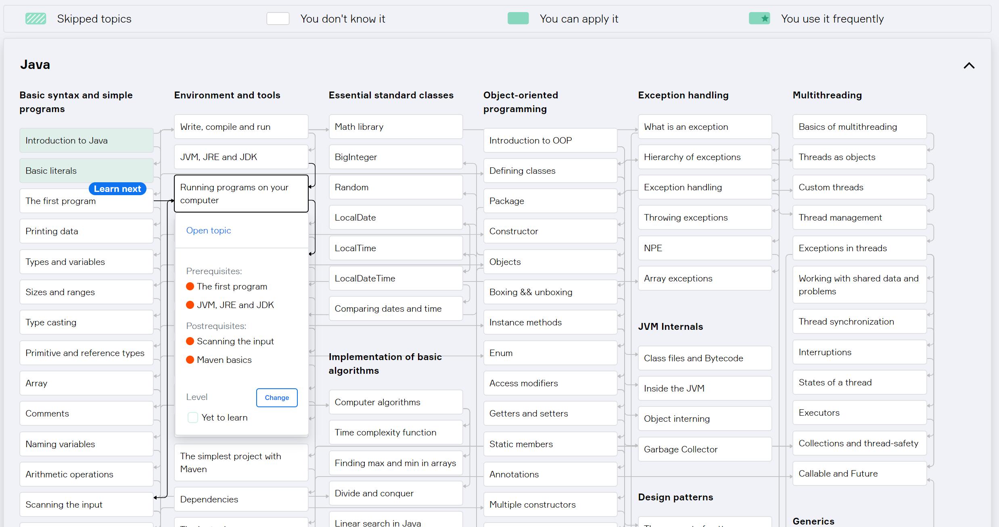
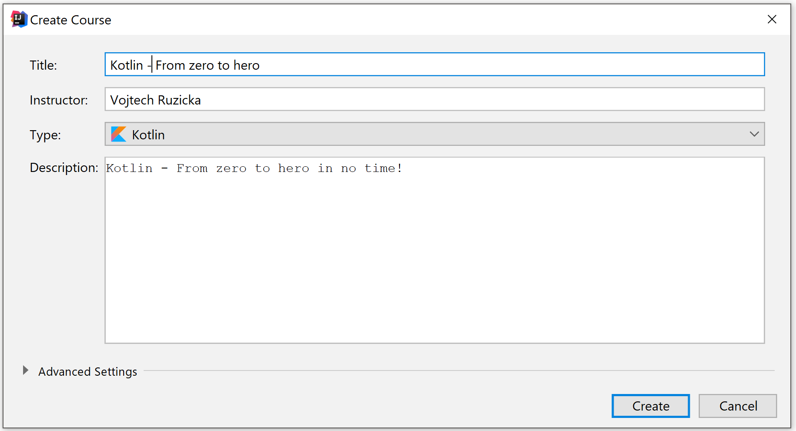
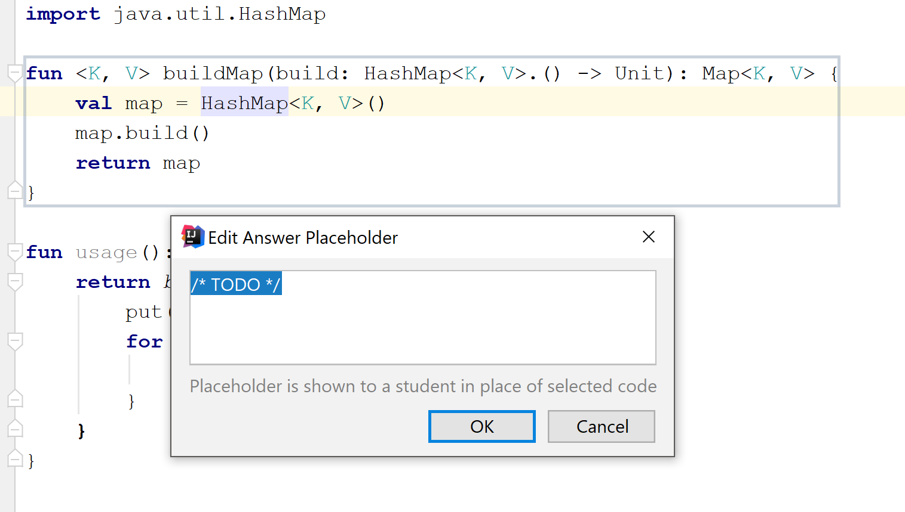

With IntelliJ IDEA Edu Tools plugin you can study various programming courses directly in your IDE and work on all the assignments. Alternatively, you can create courses yourself to share with others.

## Getting started
### Installation
If you already have IntelliJ IDEA installed, all you need to do is to install [EduTools plugin](https://plugins.jetbrains.com/plugin/10081-edutools). Just go to `File → Settings → Plugins → Marketplace` and search for EduTools. Then click `Install` and restart your IDE when finished. The plugin is available both for Ultimate and Community edition.

Alternatively, you can download [IntelliJ IDEA EDU](https://www.jetbrains.com/education/download/#section=idea), which is basically the Community Edition bundled with the EduTools plugin. If you are using Python, JetBrains also offers [Pycharm EDU](https://www.jetbrains.com/pycharm-edu/).

### Starting a course
Now, after the plugin is installed, it is time to start using it. All the interactions with the plugin are handled through

```
File → Learn and Teach
```

There are several options there, including integration with third-party educational services, such as Coursera, Stepik or Hyperskill. We'll cover these later, let's start simply by browsing available courses in the course repository:

```
File → Learn and Teach → Browse Courses
```


Some courses are gray, which means they are not yet approved by JetBrains. To start a course, simply select it and click `Join`. The join button offers an alternative action to view the course as an Educator. This allows you to access also solutions and tests, which verify whether each task is successfully completed.

Let's open a course in a normal way, as a student for now. Instead of project files as usual, you see all the chapters and the individual tasks contained in them.


As you can see, that IDEA tracks your progress and shows you what is already finished (green), what is failed (red) and what is yet to be completed (empty checkboxes).

You may select and solve individual tasks in any order. After selecting a task, you can see the task code in your editor and the description of what should you change to complete the task.


Once you are finished with your task, you can verify your solution by clicking the `Check` button. It runs predefined unit tests under the hood and based on the result it lets you know whether you passed or not.


You can either view the solution or just compare the expected output with what you have. Both these features show you a nice version control system-like diff so you can easily identify the differences.

## Integrations
The amount of courses available in the repository is still somewhat limited, so it is great that EduTools offers integration with several third-party services, which offer their own courses.

### Stepik
[Stepik](https://stepik.org/catalog?language=en) is an online educational platform, where you can either study  the available courses or publish your own.

You can log-in in IDEA to your Stepik account. This has several advantages. You'll get access to a broader range of courses and now your progress is automatically synchronized with your Stepik account.

That means that you can study either in IDEA or Stepik web editor and your progress is tracked either way. It also acts as an online backup of your progress, because normally IDEA stores your progress just in a local folder.

You can access Stepik courses in IDEA from:

```
File → Learn and Teach → Start Stepik Course
```

### Hyperskill
[Hyperskill](https://hyperskill.org) is another service integrated by EduTools. It is actually developed by Stepik. It is a very interesting tool with a slightly different focus. Instead of various independent courses, you build a number of projects. There is a big Knowledge map of various linked topics for each domain, where you can track your progress.



To open a Hyperskill project, go to:

 ```
 File → Learn and Teach → Start Hyperskill Project
 ```
 
### Coursera
[Coursera](https://www.coursera.org/) integration is a bit sporadic right now. There's just "Kotlin for Java Developers" by JetBrains, where you can solve your weekly assignments in IDEA. You can access Coursera assignments in: `File → Learn and Teach → Start Coursera Assignment`.

### Checkio
[CheckiO](https://checkio.org/) offers tasks to improve your programming skills in Javascript and Python. It motivates you through gamification. You solve coding tasks to gain XP and level up to unlock new locations and challenges. There is also a nice social aspect where you can share your solutions and compare with others, have discussions and upvote your favorites.

You can access CheckiO courses through the course browser:

```
File → Learn and Teach → Browse Courses → Js CheckiO
File → Learn and Teach → Browse Courses → Py CheckiO
```

Your progress in synchronized with the web as usual.

## Creating courses
So far, we've discussed only consuming courses created by someone else. What's great about EduTools is that it allows you to easily create your own tasks and courses. It can be a powerful tool when teaching programming.

This can be useful for hands-on tasks during the lessons, as homework assignments or even self-study material. It's good that it allows students to work with a real IDE with all the support it offers and it will teach them how to use it. They can check their solution automatically without the need to submit their code for review. And as a part of the task description, you can provide any theoretical background information necessary.

### New course

The plugin has all you need to create the course directly in IDEA. Simply go to:

```
File → Learn and Teach → Create New Course
```

Then fill some basic information about the course:



Currently, you can select one of the supported languages:
- Java
- Kotlin
- JavaScript
- Python

### Creating tasks
Now when the course is created it's time to make individual tasks. It's pretty simple. Each task consists of three parts. 


First is the description of the task. It is in the form of HTML file, so you can even provide some rich formatting, tables and so on.

The second part is the actual code. There are not two versions of files - starting state and final state. You just provide the final solution, which is expected. Then you can select certain parts of the code and `Right Click → Add Answer Placeholder`.

That means you mark specific sections of the code as hidden to the students and instead show some text like "TODO implement here".



Finally, you need to provide a way for the students to verify their solutions. This is done via one or more unit tests, which you can provide. As long as they pass, the students can move on to the next task. 

### Gradle

## Conclusion
EduTools offer you to study various programming courses and solve coding puzzles directly in your favorite IDE. No more clumsy web editors. It integrates well with various third-party educational services and it can synchronize your progress.

You are not limited to third-party courses, though. You can easily create your own courses and use them as a teaching material on your courses.