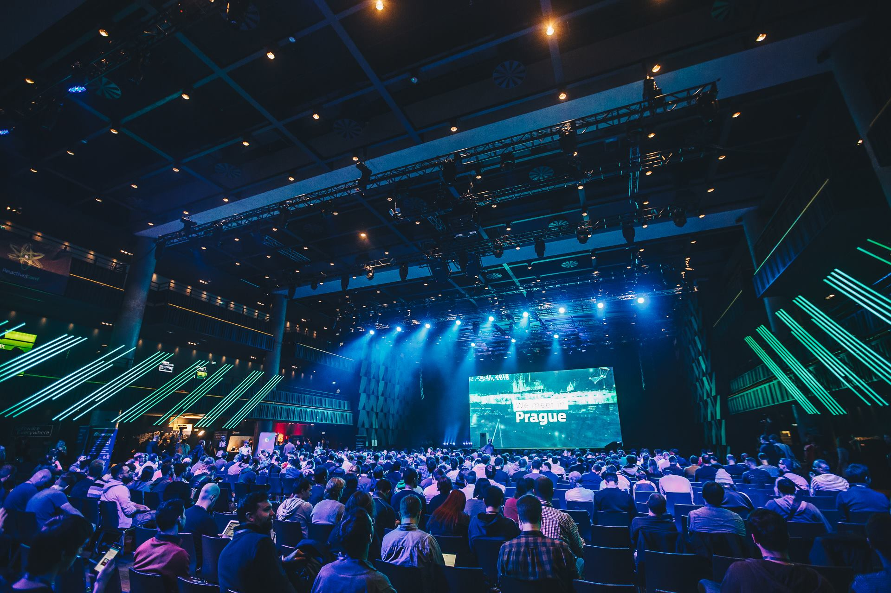
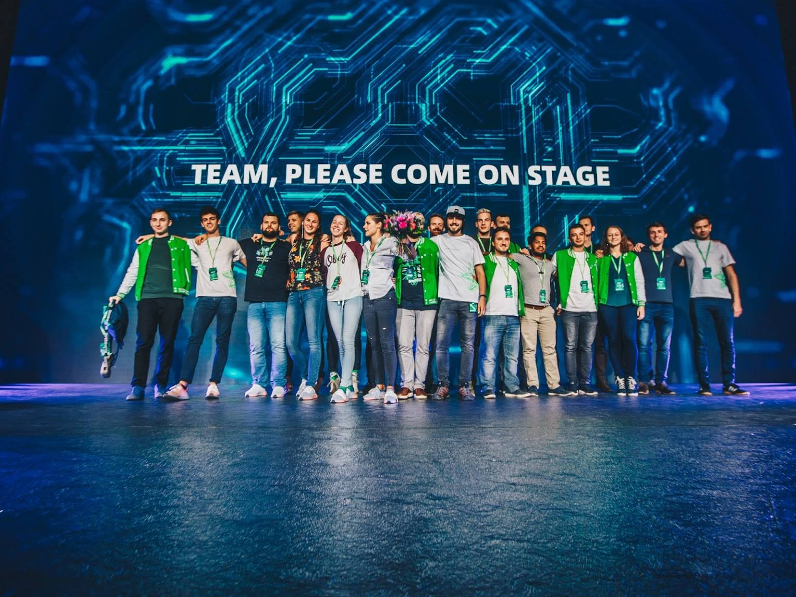
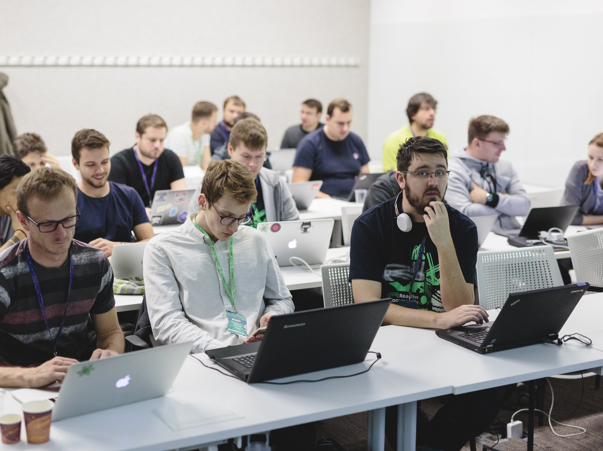

## Reactive Conf 2018
[Reactive Conf](https://reactiveconf.com/) is a three-day conference focused on modern frontend and mobile development. I attended the last year for the first time and was impressed, so going this year again was a no-brainer, especially as it moved from Bratislava to Prague, my home city.

There were two stages with parallel talks. In addition to the main stage, there was also Discovery Stage, which was focused on not only on presentations, but also on Ask Me Anything sessions with many of the speakers. This was a nice opportunity to ask questions, which in many cases, in my opinion, was even more interesting than the original talks. The questions were managed by [sli.do](https://www.sli.do/) - everyone could submit a question. Then everybody could vote for their favorite one. Questions with the most votes were then asked.

Each talk was roughly 30 minutes long including some time for the questions. The talks were also publicly streamed, so even people not attending the conference could watch. Thirty minutes is a good length in the sense that you get to see more talks and it is easy to stay focus. On the other hand, you cannot really go into much detail. It is ok for many talks, but some of them could use more time.

## Volunteering

Same as the last year, I didn't come as a regular attendee, but as a volunteer instead. The conference offers a number of "volunteer tickets", which you can apply for. The idea is simple - you get your ticket for free, but you help with running the conference. Of course, not for the whole time. Each day, you dedicate 1/3 of your time for working. The rest of the time, you are free to visit the talks, participate in workshops, attend the parties - anything you want.

The volunteer duties are diverse - registering visitors, helping speakers, dispensing gifts, navigating people around, moderation of questions, and much more. It does not really matter much that you don't get to see every talk as they are recorded and available after the conference.

However, the best part about participating as a volunteer is not about saving money. If it was the case, you could just wait for the youtube videos and watch them from the comfort of your sofa for free. Being there is an excellent opportunity to see a conference from the organizer's point of view. But most of all it is about meeting interesting like-minded people. Sure, you're supposed to network on a conference as an attendee, but I've always found it rather difficult with complete strangers as an introvert. For a volunteer, this is much easier and much more natural. You spend a lot of time with other volunteers from all over the world working together and get to talk to many people during your duties. You get a better chance to approach the speakers and access the VIP zone.

## Day 1
The beginning of the conference was the busiest period for us volunteers. We had to register more than 1000 visitors. I spent most of the time providing various goodies to the attendees in exchange for their "Reactive Gift" vouchers.

After the talks finished, there was still a lot more to do. You could stay for a "Discover Czech" event, which was basically a party with a selection of classic Czech delicacies such as nakládaný hermelín (pickled cheese), utopenec (pickled sausages), various Czech pies or traditional plum spirit slivovice. Alternatively, you could join separate parties held by the conference's sponsors in their offices - STRV, MEWS, Kiwi or Socialbakers. For those not interested in partying, there was an opportunity to join a sightseeing tour of Prague.

## Day 2
My duties changed on the second day. Now it was mostly about the Discovery Stage - showing them the way, letting them in and so on. Then some basic cleanup after the conference.

After the talks, there was a closing ceremony. Then you could choose from a bunch of "Hangouts" with various companies such as Aragon, HackPrague or Green Fox Academy. Alternatively, you could continue in discovering Prague like the day before, which would end with a tasting of local wines, beers and spirits.

## Day 3
The last day of the conference was different from the first two days. So-called "Festival day" was not at the same venue. Instead, it was hosted in the Prague Microsoft building. Unlike the first two days, this one was focused mainly on various workshops with limited capacity. It was necessary to register and pay a fee of 20 € in addition to the conference ticket. There were 14 workshops available in total ranging from 2 to 6 hours. Here is the list:

- Introduction to Elm
- GraphQL with React vs. Angular vs. Vue
- Codelab: Build your first Flutter app
- Introduction to ClojureScript
- Vue.js
- Evolving Patterns in React
- Building type-safe applications with Flow and GraphQL
- Reason DOJO: React and GraphQL
- Reason DOJO: Cross-platform Games in Reprocessing
- Simplify your data processing with BakeryJS
- Introduction to E2E testing with Cypress.io
- Service Workers at Your Service
- How to build cross-platform desktop apps with React and Electron
- Vuex like nobody is looking

In addition to workshops, there was one small stage. In the morning, there were just some recorded talks from the previous year. After that, there were regular talks for the rest of the days.

My duty for the last day of volunteering was moderating questions from attendees to speakers on sli.do for all the talks of the day. This was probably the best of my assignments as I got to see all the talks and it was interesting and kept me occupied.

After the talks and the final panel discussions with some of the speakers, there was an afterparty, still in the Microsoft building.

## Talks and Photos
If you are interested in talks, which were at Reactive Conf, you can [watch them all online](https://www.youtube.com/playlist?list=PLa2ZZ09WYepPQAIo1h98LaPkQUYwaSbWO&mc_cid=09db7b9adc&mc_eid=6613f6258f).

You can also check all the [photos](https://photos.google.com/share/AF1QipPMSR7JQ_w4QR-QuubLp5hAxjATZibHpRHwFRQLRjcP3WGef3k0qr7e9f3doDAz8A?key=TEkzSUw2aDBXQ284bXFWd0ZVemNRTTAtaktiSS1R) from the event or just watch the following 40-second video for a brief overview.

<iframe width="560" height="315" src="https://www.youtube.com/embed/h6Z76xJP2h4" frameborder="0" allow="accelerometer; autoplay; encrypted-media; gyroscope; picture-in-picture" allowfullscreen></iframe>

## Conclusion
I had a great time volunteering at Reactive Conf 2018. It was really interesting to see a conference from the organizer's perspective and a great opportunity to meet many interesting people from all over the world - the organizers, the volunteers and the speakers. I definitely recommend this as an interesting alternative to just attending a conference. 