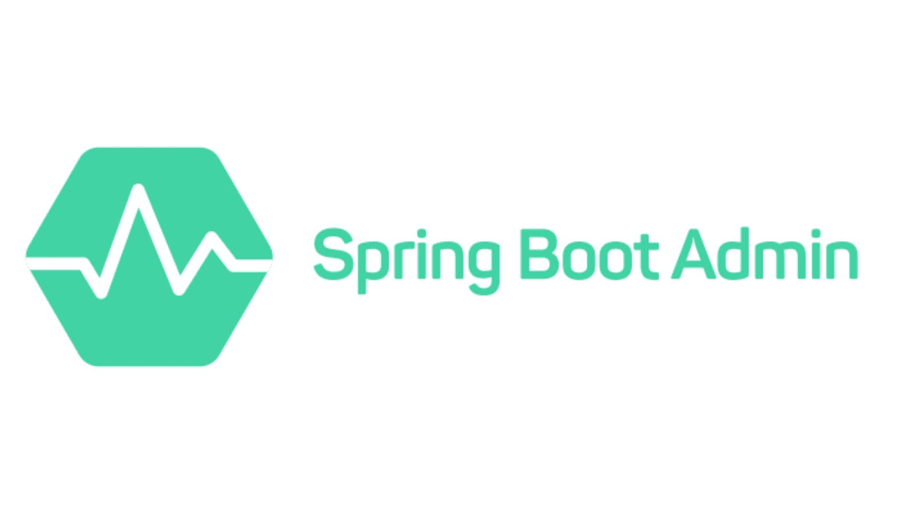
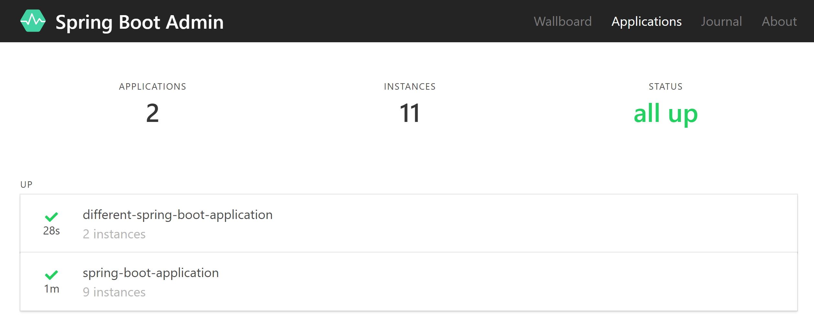
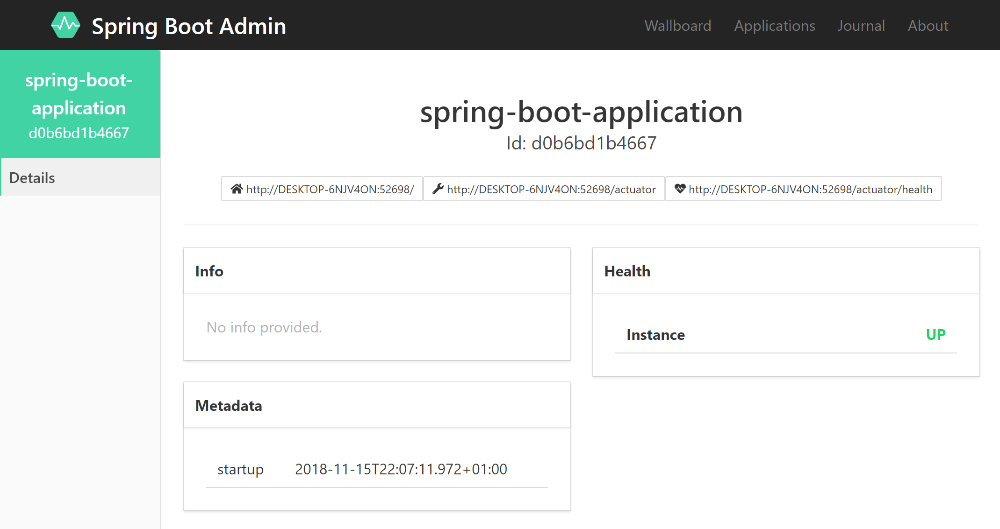
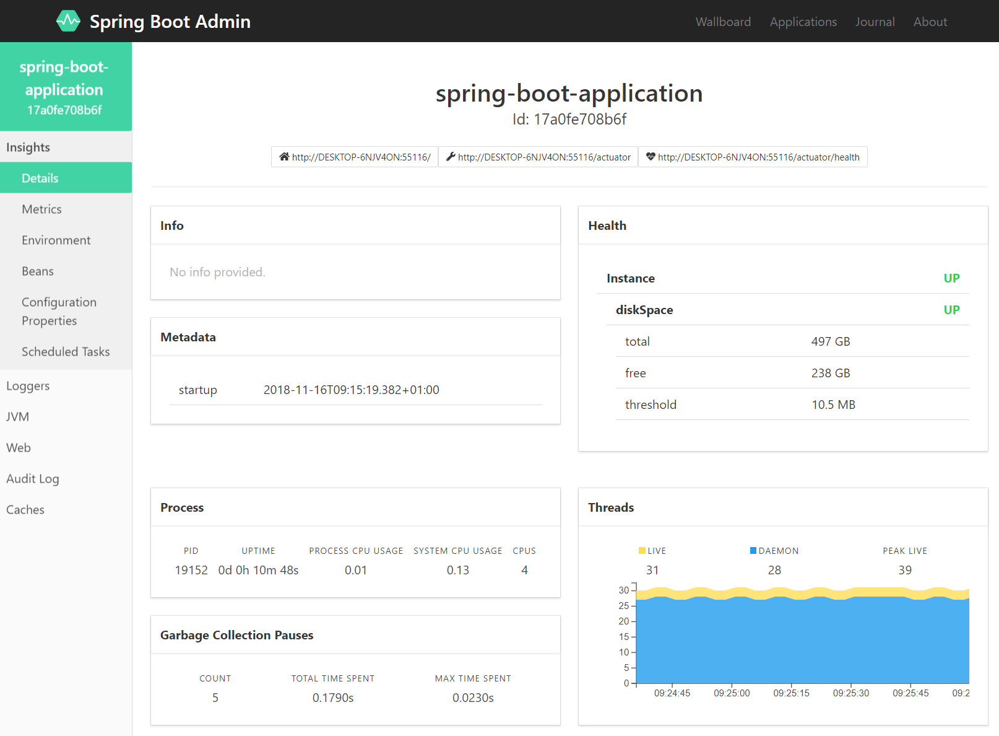
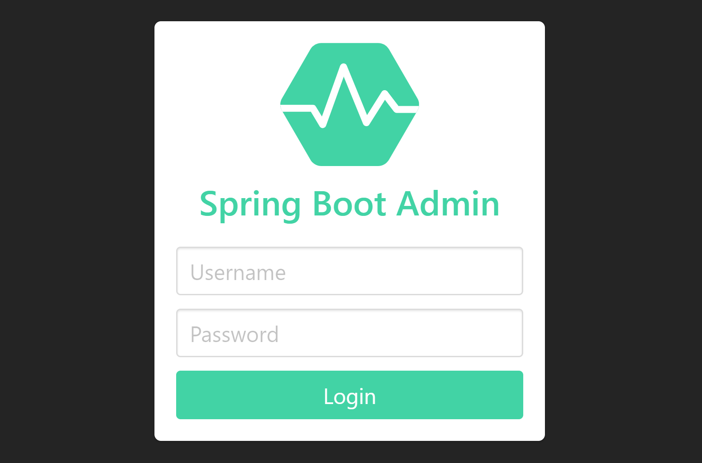

Monitor and manage you Spring Boot apps  with a nice UI on top of Spring Boot Actuator endpoints.

## Spring Boot Actuator
Actuator is a Spring Boot module, which adds REST/JMX endpoints to your application, so you can easily monitor and manage it in production. The endpoints offer health-check, metrics monitoring, access to logs, thread dumps, heap dumps, environmental info and more. I've covered Actuator in depth in the following article:

<div class="linked-post"><h4 class="front-post-title" style="margin-bottom: 0.375rem;"><a href="/spring-boot-actuator/" style="box-shadow: none;">Actuator: Spring Boot Production Monitoring and Management</a></h4><small class="front-post-info"><span class="front-post-info-date">03 September, 2018</span><div class="post-tags"><ul><li><a href="/tags/spring">#Spring</a></li><li><a href="/tags/java">#Java</a></li></ul></div></small><div><a class="front-post-image" href="/spring-boot-actuator/"><div class=" gatsby-image-wrapper" style="position: relative; overflow: hidden;"><div style="width: 100%; padding-bottom: 75%;"></div><picture><source srcset="/static/spring-boot-actuator-baf5805d4d2a459f3093063c6419e782-680c3.jpg 45w,
/static/spring-boot-actuator-baf5805d4d2a459f3093063c6419e782-0b965.jpg 90w,
/static/spring-boot-actuator-baf5805d4d2a459f3093063c6419e782-cc2e6.jpg 180w,
/static/spring-boot-actuator-baf5805d4d2a459f3093063c6419e782-feef1.jpg 270w,
/static/spring-boot-actuator-baf5805d4d2a459f3093063c6419e782-1ee31.jpg 360w,
/static/spring-boot-actuator-baf5805d4d2a459f3093063c6419e782-e8e8f.jpg 540w,
/static/spring-boot-actuator-baf5805d4d2a459f3093063c6419e782-ea010.jpg 1600w" sizes="(max-width: 180px) 100vw, 180px"></picture><noscript><picture><source srcSet="/static/spring-boot-actuator-baf5805d4d2a459f3093063c6419e782-680c3.jpg 45w,
/static/spring-boot-actuator-baf5805d4d2a459f3093063c6419e782-0b965.jpg 90w,
/static/spring-boot-actuator-baf5805d4d2a459f3093063c6419e782-cc2e6.jpg 180w,
/static/spring-boot-actuator-baf5805d4d2a459f3093063c6419e782-feef1.jpg 270w,
/static/spring-boot-actuator-baf5805d4d2a459f3093063c6419e782-1ee31.jpg 360w,
/static/spring-boot-actuator-baf5805d4d2a459f3093063c6419e782-e8e8f.jpg 540w,
/static/spring-boot-actuator-baf5805d4d2a459f3093063c6419e782-ea010.jpg 1600w" sizes="(max-width: 180px) 100vw, 180px" /></picture></noscript></div></a><span class="front-post-excerpt">Monitor and manage your application in production with Spring Boot Actuator 2.x. Gather metrics or check health easily.</span></div></div>


## Spring Boot Admin
Actuator is powerful and great and it is easy and convenient to consume the endpoints with some other application - you just make a simple REST call. It is not so great when used by a human. For humans, it is much more convenient to have a nice user interface you can use to browse all the monitoring data and manage your application. This is actually what Spring Boot Admin Does. It provides you a nice UI layer on top of actuator endpoints with a few extra features on top.

Spring Boot Admin is not a core module provided by the Spring team, it was created by a company called [Codecentric](https://blog.codecentric.de/en/). Still, the code is publicly available on [Github](https://github.com/codecentric/spring-boot-admin) and it is free.

## Client And Server
Unlike Actuator, Spring Boot Admin actually comes in two parts - Client and Server.

The Server part contains the Admin user interface and runs independently from the monitored applications. The Client part is in the monitored application, which registers with the Admin Server part.

This way, even if our application is down or not working properly, the monitoring server is still up and running. Now imagine you have multiple applications (such as Spring Boot microservices) and each of them can be running in multiple instances. With traditional Actuator monitoring, this is hard as you need to access each of them separately and you need to keep track of how many instances and where are running.

With Spring Boot Admin, each instance of your monitored application (Client) registers with the Server after it starts. Then you have a single point (Admin Server), where you can check them all.



## Source Code
The source code with a finished application can be found in [this Github repository](https://github.com/vojtechruz/spring-boot-admin).

## Server Setup
Let's first look into how to setup Spring Boot Admin Server. Let's start with a fresh Spring Boot application. You can easily create one using [Spring Initializr](https://start.spring.io/). Be sure to include the `web` module.

After creating the project, the first thing we need is to add the Spring Boot Admin Server dependency:

```xml
<dependency>
    <groupId>de.codecentric</groupId>
    <artifactId>spring-boot-admin-starter-server</artifactId>
    <version>2.1.0</version>
</dependency>
```

Note that even though the project is not created by Pivotal, you can find both the client and server modules for Spring Boot Admin in the Spring Initializr. Next, we need to enable Admin Server by annotating our main application class with `@EnableAdminServer`:

```java{2}
@SpringBootApplication
@EnableAdminServer
public class SpringBootAdminServerApplication {

    public static void main(String[] args) {
        SpringApplication.run(SpringBootAdminServerApplication.class, args);
    }
}
```

And that's it. Now you can run your application and after opening `http://localhost:8080/` you should see this:


The server is running, but no clients are registered yet. Let's change that.

## Client Setup
Same as with server setup, the first step is to add a proper dependency to an existing application:

```xml
<dependency>
    <groupId>de.codecentric</groupId>
    <artifactId>spring-boot-admin-starter-client</artifactId>
    <version>2.1.0</version>
</dependency>
```

Then you need to define URL where is your Admin Server running. Add this line to your `application.properties`:

```properties
spring.boot.admin.client.url=http://localhost:8080
```

### Adding Actuator
Now you should be able to run both the client and the server. Just make sure there is not a port conflict as both apps by default use 8080. For testing purposes, you can set `server.port=0` in your `application.properties`, so your client will use a random port on startup. This way you can test launching multiple instances running on different ports.

When you open Admin Server UI, you should see your application. When you click the app name, a page with application details should show up.



If you see a screen like above with just a minimum of information, it means that you don't have Actuator as a part of your project. Remember, Spring Boot Admin uses Actuator endpoints under the hood. Fortunately, you need just to add a simple dependency and auto-configuration does take care of the rest.

```xml
<dependency>
    <groupId>org.springframework.boot</groupId>
    <artifactId>spring-boot-starter-actuator</artifactId>
</dependency>
```

However, most of the endpoints are not exposed by Actuator by default. You need to change your configuration in `application.properties` to expose them:

```properties
management.endpoints.web.exposure.include=*
```

After exposing your Actuator endpoints, you should see much more information in your Admin interface:



For a detailed tutorial on Spring Boot Actuator configuration check [this article](https://www.vojtechruzicka.com/spring-boot-actuator/).

## Security
Now when everything is running, we should make sure our Actuator endpoints and the Admin UI are not publicly available to everyone.

### Client Security
If you are already using Spring Security, the above will not work for you as the Actuator endpoints are secured by default and your Admin server will not be able to access them. If you don't use Spring Security yet, you need to add a dependency first:

```xml
<dependency>
    <groupId>org.springframework.boot</groupId>
    <artifactId>spring-boot-starter-security</artifactId>
</dependency>
```

For testing purposes, you can temporarily disable Actuator endpoint security by `management.security.enabled=false`. However, we do want to have security enabled. If you are using basic authentication, you can just provide username and password in your properties file. These credentials will be used by Admin Server to authenticate with the client's Actuator endpoints:

```properties
spring.boot.admin.client.instance.metadata.user.name=joe
spring.boot.admin.client.instance.metadata.user.password=my-secret-password
```

By default, if not configured otherwise, Spring Boot uses default user `user` and auto-generated password each time your app starts. You can check the password in the console during startup. If you want to provide username and password required by your app explicitly, you can define it in your properties:

```properties
spring.security.user.name=joe
spring.security.user.password=my-secret-password
```

### Server Security
Same as with the client, we need to add Spring Security dependency:

```xml
<dependency>
    <groupId>org.springframework.boot</groupId>
    <artifactId>spring-boot-starter-security</artifactId>
</dependency>
```

Now lets configure username and password required to login to the Admin Server in your `application.properties`:

```properties
spring.security.user.name=admin
spring.security.user.password=admin-password
```

Now in your **Client** you need to add these credentials as well, otherwise it will not be able to register with the server:

```properties
spring.boot.admin.client.username=admin
spring.boot.admin.client.password=admin-password
```

Now back to the **Server** part. The last thing we need is to add Spring Security configuration to protect the Admin user interface:

```java
@Configuration
public class SecurityConfig extends WebSecurityConfigurerAdapter {

    @Override
    protected void configure(HttpSecurity http) throws Exception {
        SavedRequestAwareAuthenticationSuccessHandler successHandler 
            = new SavedRequestAwareAuthenticationSuccessHandler();
        successHandler.setTargetUrlParameter("redirectTo");
        successHandler.setDefaultTargetUrl("/");

        http.authorizeRequests()
            .antMatchers("/assets/**").permitAll()
            .antMatchers("/login").permitAll()
            .anyRequest().authenticated().and()
            .formLogin().loginPage("/login")
            .successHandler(successHandler).and()
            .logout().logoutUrl("/logout").and()
            .httpBasic().and()
            .csrf()
            .csrfTokenRepository(CookieCsrfTokenRepository.withHttpOnlyFalse())
            .ignoringAntMatchers(
                "/instances",
                "/actuator/**"
             );
    }
}
```

What it does, is that it restricts the admin UI only to authenticated users using HTTP basic authentication and form login. The login page itself and static UI resources (javascript, HTML, CSS) are public. Otherwise, you could not log in. Then there is a cookie-based Cross-Site Request Forgery protection. You can see that some paths are ignored in CSRF protection - it's because the Admin Server currently [lacks proper support](http://codecentric.github.io/spring-boot-admin/current/#_csrf_on_actuator_endpoints).


Now after a restart, you should see a nice login screen protecting your Admin Server:



## Cloud Discovery
Spring Boot Admin client is not the only way to register your applications with the server. Admin Server also supports Spring Cloud Service Discovery. You can read more in the [offical documentation](http://codecentric.github.io/spring-boot-admin/current/#spring-cloud-discovery-support) or in the [Spring Cloud Discovery with Spring Boot Admin](https://zoltanaltfatter.com/2018/05/15/spring-cloud-discovery-with-spring-boot-admin/) article.

## Notifications
Once you have monitoring in place, you want to get notified when something goes wrong. The good news is that Spring Admin provides a wide variety of notification options.  

If you visit the Admin Server page for the first time, it asks you for permission to display push notifications on your computer. Whenever there is an issue, you'll get a popup message.


Other notifications need a simple configuration. It usually means just providing a few entries in your `application.properties`. Currently supported services are:

* Mail
* [Slack](https://codecentric.github.io/spring-boot-admin/current/#slack-notifications)
* [HipChat](https://codecentric.github.io/spring-boot-admin/current/#hipchat-notifications)
* [PagerDuty](https://codecentric.github.io/spring-boot-admin/current/#pagerduty-notifications)
* [OpsGenie](https://codecentric.github.io/spring-boot-admin/current/#opsgenie-notifications)
* [Let's Chat](https://codecentric.github.io/spring-boot-admin/current/#letschat-notifications)
* [Telegram](https://codecentric.github.io/spring-boot-admin/current/#ms-teams-notifications)
* [Microsoft Team](https://codecentric.github.io/spring-boot-admin/current/#telegram-notifications)

### Configuring Email Notifications
If you want to enable email notifications, you need to add Spring email dependency to your **Server** part:

```xml
<dependency>
    <groupId>org.springframework.boot</groupId>
    <artifactId>spring-boot-starter-mail</artifactId>
</dependency>
```

Then you need to define your SMTP server, which will be used to send email notifications and credentials. Update your `application.properties` of your Admin Server.

```properties
spring.mail.host=smtp.foo.com
spring.mail.username=smtp-server-user
spring.mail.password=smtp-server-password
```

Then you need to define recipients and sender.

```properties
# Sender email address
spring.boot.admin.notify.mail.from="Spring Boot Admin <noreply@foo.com>"
# Comma-delimited list of recipient email addresses
spring.boot.admin.notify.mail.to=alice@foo.com,bob@bar.com
# Comma-delimited list of carbon copy recipient email addresses
spring.boot.admin.notify.mail.cc=joe@foo.com
```

## Conclusion
Spring Boot Admin offers a nice and useful UI layer on top of Actuator Endpoints. What's more, it allows you to centrally monitor multiple applications with multiple instances, which is invaluable when working in the cloud and with microservices. Make sure though, that you sufficiently protect both your Client and Server. For further information, please check the [official documentation](http://codecentric.github.io/spring-boot-admin/current/).