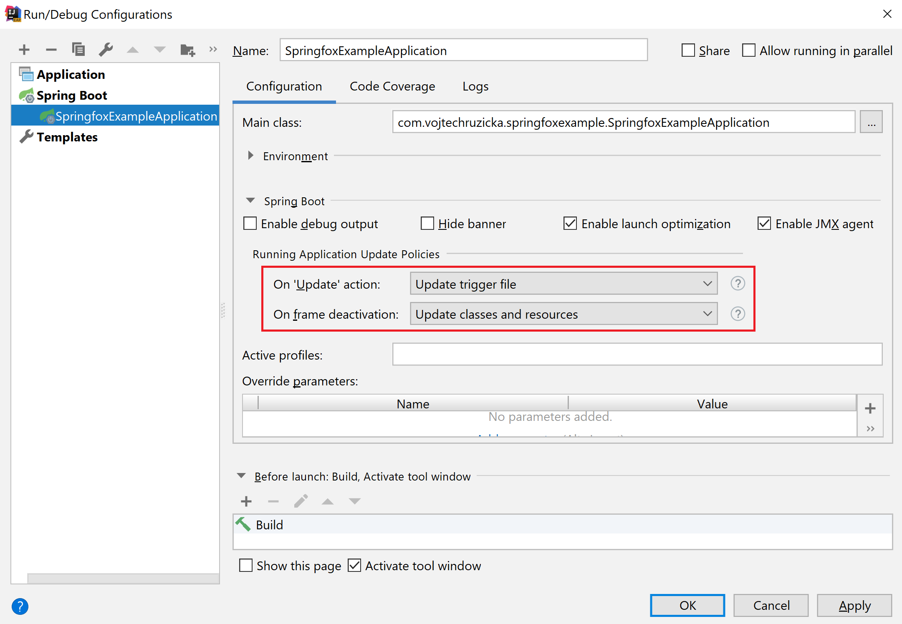
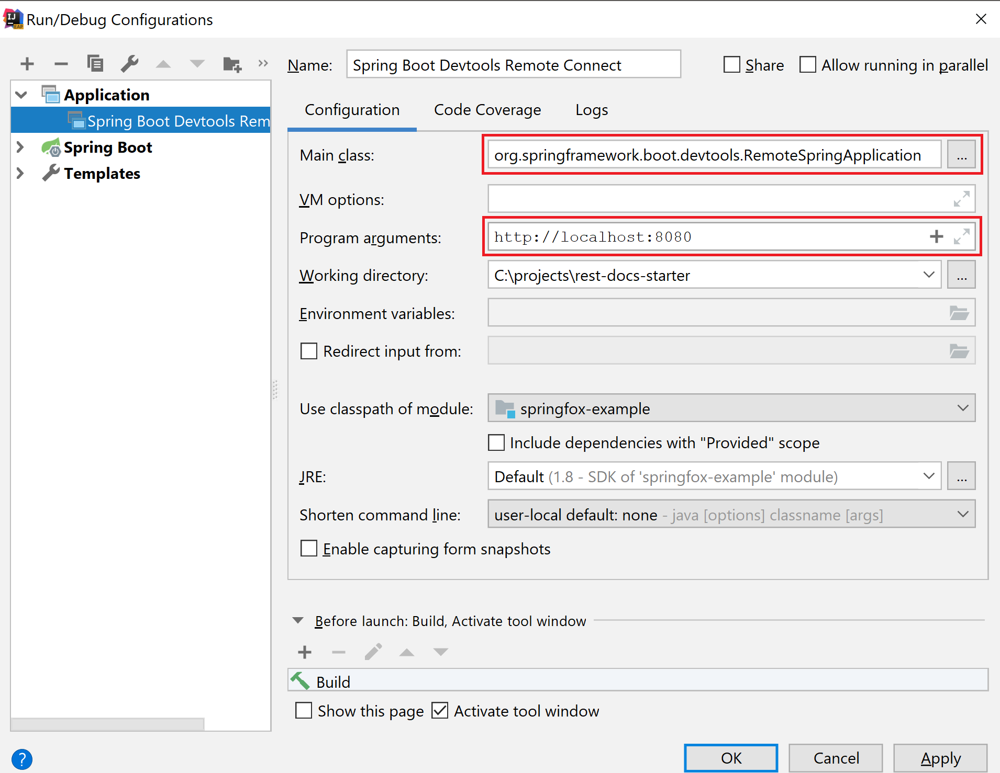

How to speed up your Spring Boot development even more with DevTools and make it more enjoyable and productive? 

# Setup
As usually with Spring Boot, the setup is really simple. All you need to do is to add the right dependency, and you are good to go. Spring Boot detects this and auto-configures DevTools accordingly.

If you are using Maven:

```xml
<dependency>
    <groupId>org.springframework.boot</groupId>
    <artifactId>spring-boot-devtools</artifactId>
    <optional>true</optional>
</dependency>
```

Alternatively, when using Gradle:

```
configurations {
    developmentOnly
    runtimeClasspath {
        extendsFrom developmentOnly
    }
}
dependencies {
    developmentOnly("org.springframework.boot:spring-boot-devtools")
}
```

Note that the dependency is declared as optional. This is important. This prevents DevTools dependency being transitively applied to other modules that depend on your project.

## Automatic Restart
Whenever there is a change in files on your classpath, DevTools automatically restart your running application with the new changes applied. When developing locally, this can be valuable as you don't need to redeploy your application manually.

On its own, it wouldn't be so useful as restarts can still take a lot of time. Fortunately, these restarts are way faster than regular restarts because of a clever trick, which DevTools use.

You see, when developing an application, you usually change a class or a few and want to check results in your running application for feedback. You change a tiny fraction of your application as the majority of loaded classes are from frameworks and third party libs.
 
 Under the hood, Spring DevTools use two classloaders - *base* and *restart*. Classes which do not change are loaded by the *base* classloader. Classes you are working with are loaded by *restart* classloader. Whenever a restart is triggered, *restart* classloader is discarded and recreated. This way restarting your application is much faster than usual and can be a viable alternative to dynamic class reloading with tools such as JRebel.

### Triggering a restart in an IDE
The restart is triggered whenever there is a change on the classpath. However, this varies depending on your IDE. That means, it is not enough to just change your `.java` files. What matters is that your IDE actually updates `.class` files on the classpath.

When using IntelliJ IDEA, you need to build your project (*Ctrl + F9* or *Build → Build Project*). You can also [configure IDEA to rebuild automatically](https://www.mkyong.com/spring-boot/intellij-idea-spring-boot-template-reload-is-not-working/). Alternatively, you can open your Spring Boot run configuration and define what happens when you trigger an application update (*Ctrl + F10*):



In the first combo-box, you can select `Update trigger file` to trigger DevTools restart whenever you call the `Update` action. Alternatively, you can even select the option to try Hot Swap and restart using DevTools only if Hot Swap failed.

In the second combo-box, you can configure reloading all the static resources and templates when IDEA window loses focus (for example when switching to a browser window).

In Eclipse it is enough just to save your files.

## Development only
The usage of the Spring Boot DevTools is intended only for development, not for production. If your application detects you're running in production, DevTools are automatically disabled.

For this purposes, whenever you run your app as a fully packaged artifact such as a jar with an embedded application server, it is considered to be a production app:

```
java -jar devtools-example-1.0.0.jar
```

Same applies when your app is started via special classloader, such as on an application server. In contrast, when you run an exploded artifact (such as in your IDE), your application is considered in development mode. The same applies when using spring-boot-plugin to run the application:

Maven:
```
mvn spring-boot:run
```

Gradle:

```
gradle bootRun
```

## Live Reload
[LiveReload](http://livereload.com/) is a useful tool, which allows you to instantly update your page in browser whenever you make changes in your files such as HTML, CSS, images and more. It even pre-processes files as needed - that means automatically compiling your SASS or LESS files.


Spring DevTools automatically launch a local instance of LiveReload server, which monitors your files. All you need to do is to install a [browser extension](http://livereload.com/extensions/), and you're good to go. It is not only useful for developing frontend of your application (in case you distribute it as a part of your Spring app artifact), but it can also be used to monitor and reload output of your REST API.

## Properties override
When developing your application locally, you usually have different configuration needs than when running in production. One example can be caching. When in production, it is crucial to depend on various caches (such as templating engine's caches, caching headers for static resources and so on). In development, it can make you miserable by serving old data and not reflecting your latest changes. Another example may be enhanced logging, which can be useful in development but too detailed for production.

It is unnecessarily complicated to manage dual sets of configuration by yourself. The good news is that Spring Boot DevTools configure many properties for your local development out of the box. 

```properties
spring.thymeleaf.cache=false
spring.freemarker.cache=false
spring.groovy.template.cache=false
spring.mustache.cache=false
server.servlet.session.persistent=true
spring.h2.console.enabled=true
spring.resources.cache.period=0
spring.resources.chain.cache=false
spring.template.provider.cache=false
spring.mvc.log-resolved-exception=true
server.servlet.jsp.init-parameters.development=true
spring.reactor.stacktrace-mode.enabled=true
```

You can check the list of all the properties in the [DevToolsPropertyDefaultsPostProcessor](https://github.com/spring-projects/spring-boot/blob/v2.0.6.RELEASE/spring-boot-project/spring-boot-devtools/src/main/java/org/springframework/boot/devtools/env/DevToolsPropertyDefaultsPostProcessor.java).

## Remote connection
In addition to local development, you can also connect to a remote application running DevTools. This is not intended for production environments as it can be a serious security risk. However, it can be very useful in pre-production environments.

### Enabling remote connection
Remote connection is not enabled by default. You need to explicitly enable it by modifying your pom file:

```xml{7}
<build>
    <plugins>
        <plugin>
            <groupId>org.springframework.boot</groupId>
            <artifactId>spring-boot-maven-plugin</artifactId>
            <configuration>
                <excludeDevtools>false</excludeDevtools>
            </configuration>
        </plugin>
    </plugins>
</build>
```

Or with gradle, [you need to set](https://docs.spring.io/spring-boot/docs/current/gradle-plugin/reference/html/#packaging-executable-configuring-excluding-devtools) `excludeDevtools = false`:

```
bootWar {
    excludeDevtools = false
}
```

Then you need to set a secret password to be used for authentication when connecting to the remote application

```properties
spring.devtools.remote.secret=somesecret
```

### Connecting to a remote app

Once your remote app is running, you can launch a remote connection session. Now all you need to do is to launch `org.springframework.boot.devtools.RemoteSpringApplication` with URL of your remote app as an argument. Note you should use `https` if possible. 

Running the remote connection is easy in your IDE. In IDEA you need just to create a new run configuration. Go to `Run → Edit Configurations...` and create a new configuration with the `+` icon in the upper left corner. Choose `Application` type.

As the Main class select `RemoteSpringApplication` from the DevTools module and as a program argument pass URL of your remote app.



After you run this configuration, you should see a similar output if the connection to your remote app is successful.

```
  .   ____          _                                              __ _ _
 /\\ / ___'_ __ _ _(_)_ __  __ _          ___               _      \ \ \ \
( ( )\___ | '_ | '_| | '_ \/ _` |        | _ \___ _ __  ___| |_ ___ \ \ \ \
 \\/  ___)| |_)| | | | | || (_| []::::::[]   / -_) '  \/ _ \  _/ -_) ) ) ) )
  '  |____| .__|_| |_|_| |_\__, |        |_|_\___|_|_|_\___/\__\___|/ / / /
 =========|_|==============|___/===================================/_/_/_/
 :: Spring Boot Remote ::  (v2.0.6.RELEASE)

2018-11-02 17:24:42.126  INFO 16640 --- [           main] o.s.b.devtools.RemoteSpringApplication   : Starting RemoteSpringApplication v2.0.6.RELEASE on DESKTOP-6NJV4ON with PID 16640 (C:\Users\vojte\.m2\repository\org\springframework\boot\spring-boot-devtools\2.0.6.RELEASE\spring-boot-devtools-2.0.6.RELEASE.jar started by vojte in C:\projects\rest-docs-starter)
2018-11-02 17:24:42.130  INFO 16640 --- [           main] o.s.b.devtools.RemoteSpringApplication   : No active profile set, falling back to default profiles: default
2018-11-02 17:24:42.172  INFO 16640 --- [           main] s.c.a.AnnotationConfigApplicationContext : Refreshing org.springframework.context.annotation.AnnotationConfigApplicationContext@3daa422a: startup date [Fri Nov 02 17:24:42 CET 2018]; root of context hierarchy
2018-11-02 17:24:42.679  WARN 16640 --- [           main] o.s.b.d.r.c.RemoteClientConfiguration    : The connection to http://localhost:8080 is insecure. You should use a URL starting with 'https://'.
2018-11-02 17:24:42.800  WARN 16640 --- [           main] o.s.b.d.a.OptionalLiveReloadServer       : Unable to start LiveReload server
2018-11-02 17:24:42.829  INFO 16640 --- [           main] o.s.b.devtools.RemoteSpringApplication   : Started RemoteSpringApplication in 1.212 seconds (JVM running for 1.877)

```


Once you connect to a remote app, DevTools monitors classpath changes same as it does for local development. However, instead of a local restart, it pushes the changes to the remote server and triggers restart there. This can be a lot faster than building the app and deploying to the remote machine. 

## Global configuration
You can configure DevTools using configuration properties as you would in any other Spring application. That usually means editing `application.properties` of your project. This configuration is separate for each application.

However, in some scenarios, it may be handy to have global configuration for ALL the applications running on the same machine. You can create a property file called `.spring-boot-devtools.properties` located in your `$HOME` directory. Config declared in this file is applied to all the applications running DevTools.

## Limitations
### Live Reload
Spring app using DevTools automatically launches a LiveReload server. Unfortunately, only one instance of this server can be running at the same time. To be more precise, just the first one will work. That applies not only to multiple instances of Spring apps with DevTools but to any other apps, which are also using LiverReload under the hood, such as [Gatsby](https://www.vojtechruzicka.com/gatsby-migration/) in development mode.

If you want to configure your Spring app not to launch a LiveReload server, you can do it in your `application.properties`:

```properties
spring.devtools.livereload.enabled=false
```

### Shutdown Hook
DevTools are dependent on the [shutdown hook](https://docs.spring.io/spring-boot/docs/current/api/org/springframework/boot/SpringApplication.html#setRegisterShutdownHook-boolean-) of `SpringApplication`. It will not work correctly if you manually disabled the hook using:

```java
springApplication.setRegisterShutdownHook(false);
```

By default, the hook is enabled, so you don't need to worry about it unless you explicitly disable it.

### Collisions with third-party libraries
While DevTools should usually run properly, it may have conflicts with third party libs. In particular, there is a [known issue](https://docs.spring.io/spring-boot/docs/current/reference/html/using-boot-devtools.html#using-boot-devtools-known-restart-limitations) with deserialization using standard `ObjectInputStream`.

In case of such conflict, you can disable the automatic restart by setting:

```properties
spring.devtools.restart.enabled=false
```

Restart will no longer be triggered. However, the *restart* classloader will still be used. If you need to disable the classloader completely, you need to do so before launching the app:

```java
public static void main(String[] args) {
    System.setProperty("spring.devtools.restart.enabled", "false");
    SpringApplication.run(MyApp.class, args);
}
```

Even if you don't use th automatic restart you can still benefit from the other features DevTools provide.
     
## Conclusion
DevTools make your development of Spring Boot applications faster and easier by providing automatic restart and LiveReload functionality.
I addition to this, it sets various properties to values more suitable for local development. Furthermore, it allows you to remotely connect to your application and still use most of its features. When running in production, DevTools are not used. For detailed information, see the [official docs](https://docs.spring.io/spring-boot/docs/current/reference/html/using-boot-devtools.html).